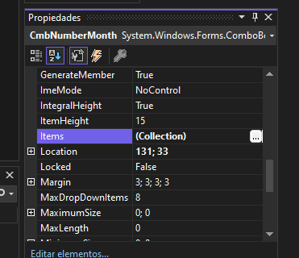
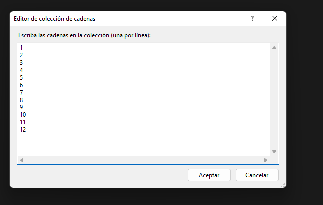

# ComboBox
Para los que migran del desarrollo web este control sería lo mismo que se logra al usar la etiqueta "select" y "option".
```html 
<select>
	<option value="">1</option>
</select>
```

En el elemento ComboBox, las opciones para seleccionar se les denomina ***items***  y son definidos en la propiedad del mismo nombre.

En esta ocasión los atributos se han defininido de forma manual en el panel de propiedades.


<br>
*Propiedad item en el panel de propiedades.*

<br>


<br>
*Items del comboBox, **se definen línea por línea**.*

***

Este es el método que se ejecuta al cambiar de opción en el comboBox:
```csharp
	//CmbNumberMonth => Es el nombre del control.
	//_SelectedIndexChanged => Es el evento que se ejecuta al cambiar de opción.

	private void CmbNumberMonth_SelectedIndexChanged(object sender, EventArgs e)
    {
		//Acción que se realiza al cambiar de  opción .		
    }
```
