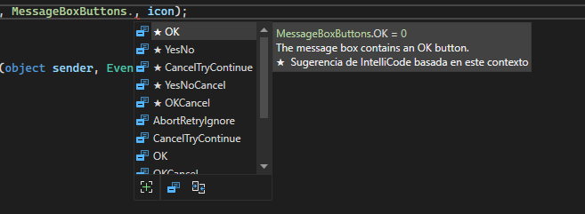
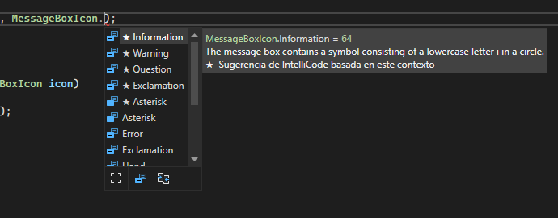

# MessageBox
Para los desarrolladores web, con este controlse lograría lo equivalente a abrir un modal, con la diferencia que se puede configurar los botones e íconos que se quiere mostrar.

Este control se compone de cuatro partes:
- El cuerpo del mensaje.
- El tìtulo.
- Los botones.
- El ícono

Ejemplo:
```csharp
	Message.Show("Cuerpo de mensaje","Título",MessageBoxButtons.Ok, MessageBoxIcon.Information);
```

Método usado para crear mensajes personalizados.
```csharp
    private void ShowMessage(string message, string title, MessageBoxIcon icon)
        {
            MessageBox.Show(message, title, MessageBoxButtons.OK, icon);
        }
```

## Opciones para los botones del control MessageBox

<br>
*Cada opción indica los botones que mostrrá el conntrol.*
## Opciones para los íconos del control MessageBox


