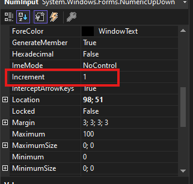
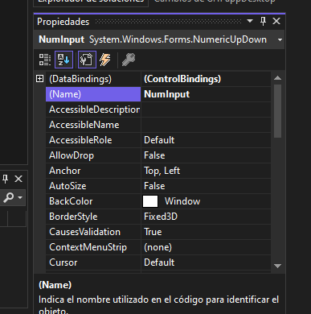

# NumericUpDown
Este control sería el equivalente a un input:number en el desarrollo web, igualmente podemos definir las siguientes características:
- Un rango de valores validos a ingresar.
- Un valor inicial.
- Si el control solo será de lectura (readOnly).
- El incremento.

Ejemplo en HTML:
```html
<input type="number" value="1" min="1" max="10" step="1" readonly>
```

Las diferencias hasta el momento son las siguientes:
- EL incremento, que en HTML se define con el atributo "step" ahora se define la propiedad "increment".

- Podemos definir la cantida de decimales que se usar con el atributo DecimalPlaces, que pueden iniciar desde 0.

- Para definir el valor máximo se usa "Maximum" y para el mínimo "Minimum"


## Acceso a su valor
Al igual que el desarrollo web, se obtiene el valor mediante el atributo value, para eso hacemos referencia al nombre del control, definido previamente en el atributo name


Ejemplo:
```csharp
	private void BtnEvaluateNumber_Click(object sender, EventArgs e)
        {
            int number = (int)NumInput.Value;
            //La conversión a entero es dependiendo del caso (opcional)
        }
```
