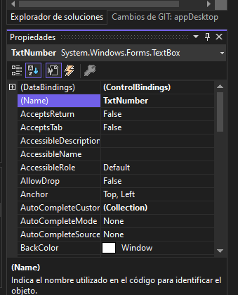
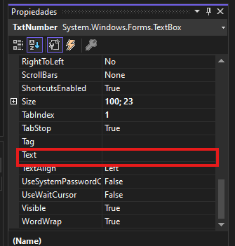
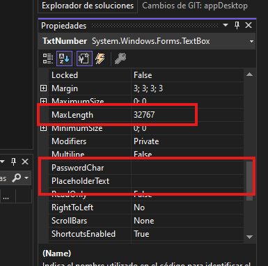

# TextBox
En el desarrollo web, este control sería el equivalente a la etiqueta input, aqui también podemo configurar valores como:
- La longitud máxima de caracteres.
- Un placeholder
- Si es solo de lectura (readOnly)
- Un texto por defecto
- Etc.

Ejemplo HTML:
```html
<input type="text" value="Texto por defecto" maxlength="8" placeholder="Texto por defecto" readonly>
```

## Propiedades

<br>


<br>
*El atributo Text es el texto que aparesería por defecto*
<br>



## Acceder al valor
Ejemplo:
```csharp
	//TxtNumber => Nombre del control
    //TextChanged => Evento que se dispara al haber un cambio en el control

    private void TxtNumber_TextChanged(object sender, EventArgs e)
    {
        //Para obtener el valor del control se accede a la propiedad  .Text
        string numberText = TxtNumber.Text;
    }

```